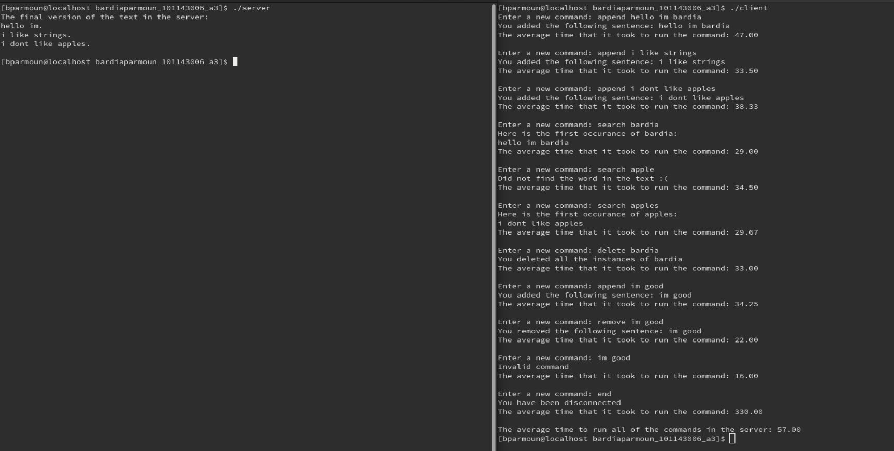

# A simple text server

by Bardia Parmoun

Released on: 27/03/2021

## DESCRIPTION
- This program is used to replicate the behaviour of a simple text managing software.
- It uses 2 message queues to connect the two processes of the server and client program.
- The server supports 4 basic commands:
  - The append command is used to append a new sentence to the server
  - The search command is used to find the first instance of a word in the text
  - The delete command is used to delete all the instances of a given word in the text.
  - The remove command is used to delete the first instance of a given sentence in the text.

## RUNNING THE PROGRAM
- This programs needs to be tested in a Linux environment. 
- Requires a gcc version of 9.3.1 or higher
1. To run the program first run the makefile to compile the executable file by typing:
```shell
$ make
```
2. After that two executables with the name of "server" and "client" has been generated which  can be run using:
```shell
$ ./server
$ ./client
```
Note that client and server should be ran on two different terminals and in order to establish a valid connection the server program should run before the client program. 

<p align="center">
Here is an example of how to run the program

</p>

## USING THE PROGRAM
After running the program you will be prompted by the program to enter a new command and the server will act accordingly:

Here are some examples of using the said commands:
### Using append: 
```
append:
Enter a new command: append hello my name is Bardia
You added the following sentence: hello my name is Bardia
The average time that it took to run the command: 22.00

Enter a new command: append i like strings
You added the following sentence: i like strings
The average time that it took to run the command: 22.00

Enter a new command: append goodbye
You added the following sentence: goodbye
The average time that it took to run the command: 22.00

Enter a new command: end
You have been disconnected
The average time that it took to run the command: 81.00
```

### Using search: 
```
Enter a new command: append hello my name is Bardia
You added the following sentence: hello my name is Bardia
The average time that it took to run the command: 22.00

Enter a new command: append I like strings
You added the following sentence: I like strings
The average time that it took to run the command: 22.00

Enter a new command: append I dont like apples
You added the following sentence: I dont like apples
The average time that it took to run the command: 23.00

Enter a new command: search Bardia
Here is the first occurance of Bardia:
hello my name is Bardia
The average time that it took to run the command: 21.00

Enter a new command: search apples
Here is the first occurance of apples:
I dont like apples
The average time that it took to run the command: 20.50

Enter a new command: search like
Here is the first occurance of like:
I like strings
The average time that it took to run the command: 21.67
```

### Some of examples of things to avoid when using search:
```
Enter a new command: append hello my name is Bardia
You added the following sentence: hello my name is Bardia
The average time that it took to run the command: 23.00

Enter a new command: append I like strings
You added the following sentence: I like strings
The average time that it took to run the command: 22.00

Enter a new command: append I dont like apples
You added the following sentence: I dont like apples
The average time that it took to run the command: 25.33

Enter a new command: search bardia
Did not find the word in the text :(
The average time that it took to run the command: 19.00

Enter a new command: search don't
Did not find the word in the text :(
The average time that it took to run the command: 19.50

Enter a new command: search ello
Did not find the word in the text :(
The average time that it took to run the command: 19.67

Enter a new command: search i
Did not find the word in the text :(
The average time that it took to run the command: 19.75

Enter a new command: end
You have been disconnected
The average time that it took to run the command: 88.00
```
Notice how search is case sensitive and it only works when the full word is being search not just any substring of it.

### Using delete
```
Enter a new command: append hi i am bardia
You added the following sentence: hi i am bardia
The average time that it took to run the command: 24.00

Enter a new command: append bardia likes strings
You added the following sentence: bardia likes strings
The average time that it took to run the command: 22.50

Enter a new command: append bardia does not like apples
You added the following sentence: bardia does not like apples
The average time that it took to run the command: 17.33

Enter a new command: delete bardia
You deleted all the instances of bardia
The average time that it took to run the command: 20.00

Enter a new command: delete like
You deleted all the instances of like
The average time that it took to run the command: 14.00

Enter a new command: end
You have been disconnected
The average time that it took to run the command: 87.00
```
### Some of examples of things to avoid when using delete:
```
Enter a new command: append hi im bardia
You added the following sentence: hi im bardia
The average time that it took to run the command: 28.00

Enter a new command: append bardia likes apples
You added the following sentence: bardia likes apples
The average time that it took to run the command: 24.00

Enter a new command: delete Bardia
Did not find the word in the text :(
The average time that it took to run the command: 27.00

Enter a new command: delete pple
Did not find the word in the text :(
The average time that it took to run the command: 18.50
```
Notice how just like search, delete is case sensitive and it only works when the full word is being search not just any substring of it.

### Using remove:
```
Enter a new command: append hi im bardia
You added the following sentence: hi im bardia
The average time that it took to run the command: 28.00

Enter a new command: append bardia likes apples
You added the following sentence: bardia likes apples
The average time that it took to run the command: 24.00

Enter a new command: remove hi im bardia
You removed the following sentence: hi im bardia
The average time that it took to run the command: 20.00

Enter a new command: end
You have been disconnected
The average time that it took to run the command: 82.00

The average time to run all of the commands in the server: 37.50
```
### Some examples of cases to avoid when using remove:
```
Testing remove (unsuccessful):
Enter a new command: append hi im bardia
You added the following sentence: hi im bardia
The average time that it took to run the command: 22.00

Enter a new command: remove hi im Bardia
Could not find the sentence :(
The average time that it took to run the command: 21.00

Enter a new command: remove hi im bardia.
Could not find the sentence :(
The average time that it took to run the command: 21.00
```
As you can see remove only works when the given sentence is identical to the one in the server

## Error handling
- Make sure to always the connection using end otherwise the program will not be able to properly close the message queues.
- Avoid using sentences that are more than 35 characters long.
- Avoid white spaces before and after your sentences as this can cause potential problems with remove.
- An optional command named "display" is included inside the program. This command can be accessed by uncommenting the code for it in the server.c file. The main purpose of this command is for debugging purposes.

## CREDITS
Author: Bardia Parmoun

Copyright © 2021 Bardia Parmoun. All rights reserved
